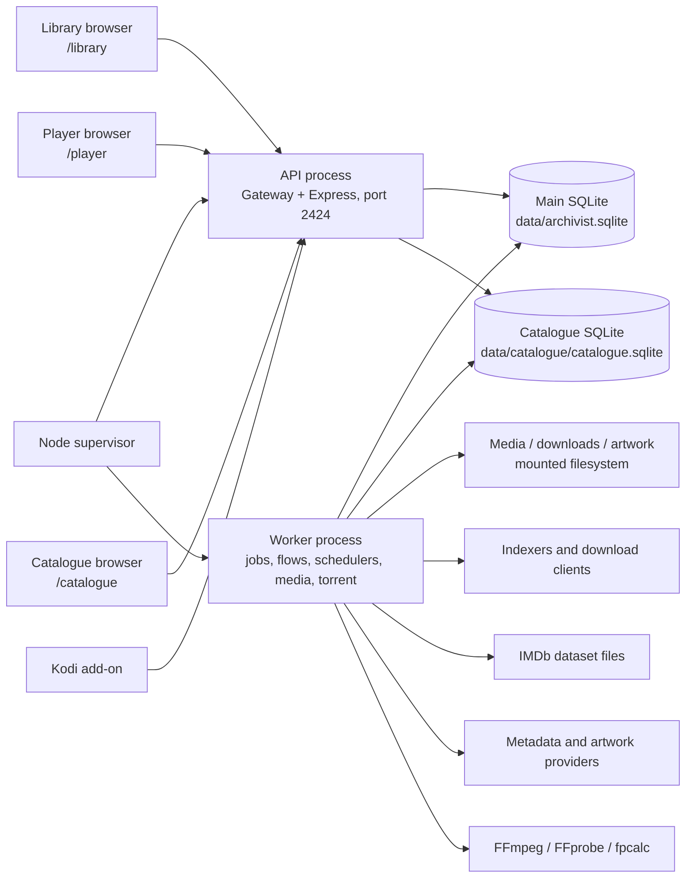
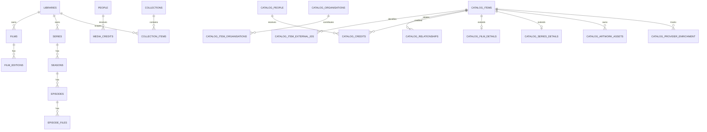
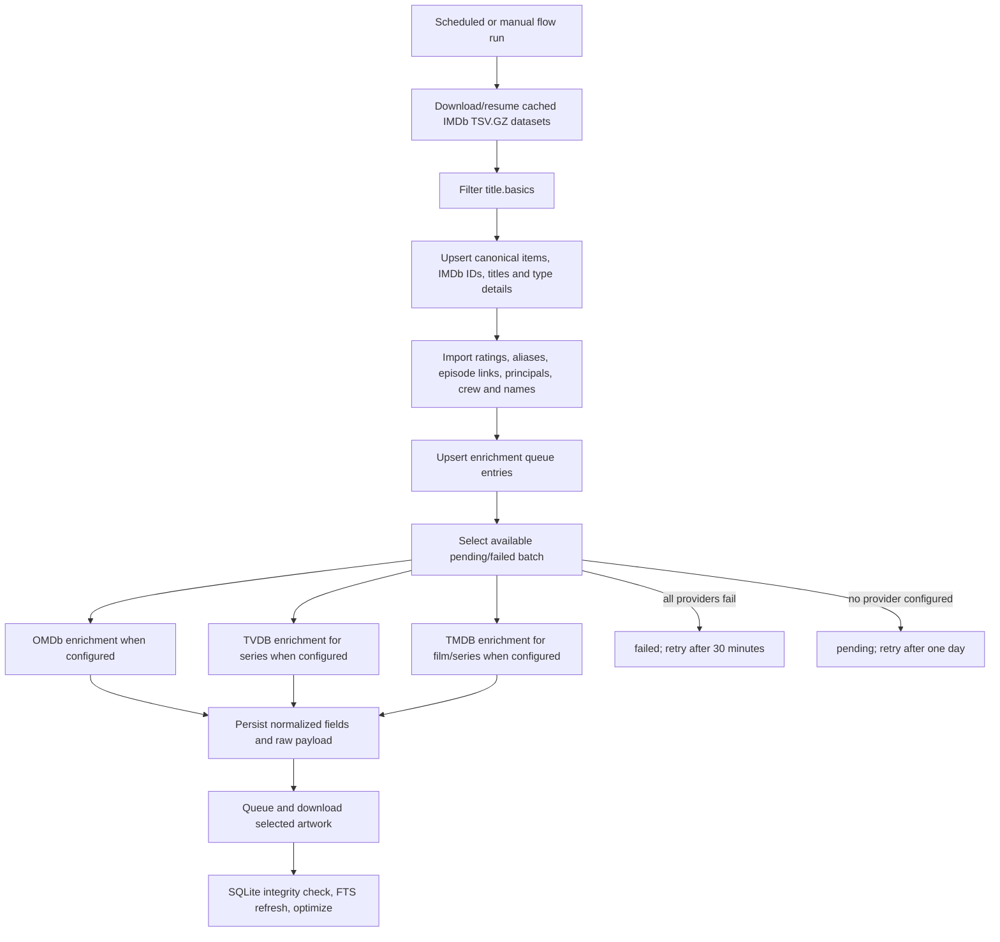

# Archivist Core

This document is the shared repository context for Archivist agents. Evidence labels have the following strict meaning throughout:

- **Confirmed** — supported directly by tracked code, configuration, schema, tests, documentation, or Git history.
- **Inferred** — strongly implied by several repository signals, but not stated or enforced as a contract.
- **Proposed** — guidance introduced by this document; it is not proof of an implemented feature or accepted roadmap item.

When a statement contains more than one category, each part is labelled separately. Runtime data under `data/`, `media/`, and `downloads/` is deliberately excluded as a design authority; schemas and code are authoritative.

## 1. Purpose

**Confirmed.** Archivist is a self-hosted system for discovering, monitoring, acquiring, importing, organising, enriching, programming, and playing a personal media collection. It supports films, television, music, books, comics, and games in its administration data model and UI. It also provides pseudo-live Channels, a browser Player, a Kodi client, acquisition automation, and an independently presented Catalogue workspace. The product description and lifecycle are documented in `README.md`; the corresponding services and routes are present under `apps/server/src/`.

**Confirmed.** The primary problem is fragmentation across media discovery, download automation, file organisation, library management, and playback. Archivist attempts to make those stages inspectable parts of one system rather than a chain of unrelated dashboards.

**Confirmed.** The current project is an alpha. Interfaces and schemas are changing quickly, and the README explicitly warns against using the application on an unbacked existing library. Recent Git history is dominated by catalogue, Leaving Soon/Sweep, Lists, acquisition matching, Player, and Kodi work.

**Confirmed.** Archivist is not currently a distributed microservice system, a PostgreSQL application, or an n8n-hosted workflow engine. The production image runs one supervisor with separate API and worker child processes and uses two local SQLite databases. Its visual Catalogue flows are native code with a fixed set of executable node types, not arbitrary n8n nodes. There is no role-based multi-user authorization model; authenticated users share administrative capabilities.

**Inferred.** The intended audience is a technically comfortable self-hoster who accepts responsibility for provider credentials, mounted media paths, download clients, backups, and lawful source access.

## 2. Product Vision

### Confirmed current direction

**Confirmed.** The current direction is an end-to-end, self-hosted media lifecycle: `Discover → Monitor → Acquire → Import → Organise → Programme → Watch`. Three web surfaces serve distinct tasks, all on port `2424` behind a path-routing gateway: Library at `/library`, Player at `/player`, Catalogue at `/catalogue`. Kodi is an additional client of the main API. See `README.md`, `apps/server/src/server.ts`, and `apps/kodi/README.md`.

**Confirmed.** The Catalogue is moving from a film-specific TMDB database toward an IMDb-led, multi-source, cross-media model with global people and organisations, external identities, raw provider payloads, reviewable identity matches, and reversible merges. The universal schema is in `packages/catalogue/src/schema.ts`; legacy film tables and migration support remain in `apps/server/src/catalogue-database.ts`.

**Confirmed.** Automation is expected to expose state and decisions. Persistent system jobs/events, acquisition decisions, flow runs, node runs, flow logs, mapping issues, Sweep runs, and processing-monitor endpoints all support that direction.

### Inferred direction

**Inferred.** Archivist is converging on a local catalogue that can reduce live provider dependence for browsing and identity resolution, while providers remain enrichment authorities. The universal schema is broader than the Catalogue runner that populates it today.

**Inferred.** The separate Admin, Player, Catalogue, and Kodi surfaces are intended to share contracts and data but remain optimized for management, consumption, curation, and television-device use respectively.

### Proposed future principles

**Proposed.** Treat catalogue completeness, provider precedence, provenance, and safe media mutation as explicit versioned contracts before expanding automated ingestion to books, music, comics, or games.

**Proposed.** Preserve the single-image self-hosting experience until a measured operational requirement justifies additional deployable services.

## 3. Core Capabilities

| Capability | Status | Evidence and boundary |
|---|---|---|
| Multi-library management for six media domains | implemented | **Confirmed —** Main SQLite tables, domain routers, and Admin modules exist for films, series, music, books, comics, and games. Depth varies by domain. |
| Film and series discovery and metadata refresh | implemented | **Confirmed —** TMDB film clients and TVDB/TMDB series clients are active under `apps/server/src/modules/`. |
| Music, book, comic, and game provider lookup | partial | **Confirmed —** MusicBrainz/Cover Art Archive/Fanart, Google Books/Open Library, ComicVine, and IGDB clients exist; automation and catalogue integration are less complete than film/series. |
| IMDb-led universal catalogue ingestion | partial | **Confirmed —** IMDb datasets, films, series, people, credits, queueing, enrichment, and artwork are implemented. Book/music universal tables are scaffolded; comic/game universal item types are absent. |
| Visual Catalogue flow editing and monitoring | implemented | **Confirmed —** Draft/published graphs, DAG validation, runs, node progress/logs, cancellation, and the Flow Studio UI exist. Executable node behavior remains hard-coded. |
| Artwork discovery, selection, download, and serving | implemented | **Confirmed —** Main library artwork and Catalogue artwork assets/variants/queue are implemented. Catalogue checksum and systematic rendition policy are incomplete. |
| Acquisition and release automation | implemented | **Confirmed —** RSS/recent-release processing, targeted missing searches, durable background item searches with 15-minute result restoration, release parsing/decisions, indexers, download clients, and import jobs exist. |
| Embedded BitTorrent | implemented | **Confirmed —** Custom bittorrent, torrent-engine, DHT/uTP port configuration, resume state, and Admin routes are present. |
| Media organisation and NFO generation | implemented | **Confirmed —** Import services and `shared/media-organizer.ts` move files, create domain folders, save art, and write NFO sidecars. |
| Browser playback and transcoding | implemented | **Confirmed —** Player routes, direct range streaming, FFmpeg transcoding, track/subtitle handling, progress, and profiles exist. |
| Kodi playback and managed mirror | implemented | **Confirmed —** Python add-on, packaging, synchronization, device credentials, caching, and tests exist under `apps/kodi/`. |
| Channels and programme guide | implemented | **Confirmed —** Channel, block, schedule, and play-session schema/services/routes exist. |
| Lists and rule-based discovery | implemented | **Confirmed —** Persistent film/series lists, TMDB compilers, media-specific genre autocomplete, Series network-ID filtering/autocomplete, scheduler, reconciliation, approval/auto modes, and tests exist. |
| Editorial collections | implemented | **Confirmed —** Archivist-owned collections support descriptions, poster/backdrop/logo URLs, ordered membership, and items spanning films, series, music, books, comics, and games. Management routes and UI live under `apps/server/src/collections/` and `client/src/modules/collections/`. |
| Leaving Soon / Sweep | implemented | **Confirmed —** Opt-in rules, notifications, keep requests, settings, dry runs, protected paths/tags, and deletion are implemented. A grace-period schema inconsistency remains. |
| Video analysis and optimization | partial | **Confirmed —** FFprobe analysis, policy/recommendation, FFmpeg remux/transcode, validation, VMAF, hardware acceleration, quarantine replacement, and durable job state exist. Interrupted replacement requires operator review rather than automatic retry. |
| Intro/credit segment analysis | partial | **Confirmed —** fingerprints, detection, matching, overrides, settings, and Player/Kodi integration exist; feature enablement is configurable and some analysis is heuristic. |
| Recommendations and ratings | implemented | **Confirmed —** ratings, feedback, recommendation reasons, and “For You” services/routes/tests exist. Ratings cover two hierarchies — film, series ⇢ season ⇢ episode, and artist ⇢ album ⇢ track — resolved by specificity. The unrated queue is driven by playback completion and so covers films and episodes only. |
| PostgreSQL or external workflow orchestration | unclear/not implemented | **Confirmed —** No production PostgreSQL client, migrations, or n8n runtime is part of the tracked application. |

## 4. System Architecture

**Confirmed.** Archivist is a pnpm monorepo. The primary production entrypoint is a supervisor that starts an HTTP API process and an independently restartable worker process. The API process owns one production listener on port `2424`; the worker owns background execution and the embedded torrent session. Vite builds the Library, Player, Catalogue, and Control React SPAs. The Library and Player use shared TypeScript contracts; the Catalogue API and UI currently use more local shapes. Kodi is a Python client of port `2424`. Archivist Control is a separate host-level process on loopback port `2429`, so it can report or restart an unhealthy primary runtime.

**Confirmed.** Port `2424` serves everything through `apps/server/src/gateway.ts`: `/library` (Library SPA), `/player` (Player SPA), `/catalogue` (Catalogue SPA), `/emulatorjs` (arcade runtime), and at the root `/api/v1`, `/media` and `/ping` handled by the Express app. The gateway runs in the API process; background execution is isolated in the worker process.

**Confirmed.** Background activity runs in the worker: system job polling, acquisition and download monitoring, user-triggered film/series searches, metadata refresh, Lists, Channels, backups, integrity/maintenance, Sweep, recommendations, segment analysis, video execution, Catalogue flows/scheduling, and the embedded torrent engine. API routes enqueue durable work. Item-search results remain recoverable for 15 minutes after completion, and the serial-by-default search lane lets navigation enqueue another subject without cancelling current work. The two processes coordinate through SQLite job state, renewable leases, process heartbeats, a torrent command/snapshot bridge, and durable events relayed to API SSE clients. One renewable singleton lease currently permits one active background worker.

**Confirmed.** Container deployment is a single multi-stage Docker image based on Node 20. The runtime installs FFmpeg and Chromaprint tooling, runs as UID/GID `1000`, exposes only application port `2424`, and mounts `/app/data`, `/app/media`, and `/app/downloads`. Optional peer ports are defined in `docker-compose.torrents.yml`. The bare-metal path uses timestamped releases with atomic `current`/`previous` links and external persistent state. `deploy/systemd/archivist.service` runs the unchanged supervisor contract, while `archivist-control.service` runs the separately built Control app with a localhost-only default, token-gated mutations, bounded journald access, and allowlisted lifecycle actions. Control runs as an unprivileged locked account; polkit restricts it to start/stop/restart of `archivist.service` and verifies the originating systemd unit.

## 5. Repository Structure

| Path | Responsibility | Notes |
|---|---|---|
| `apps/server/` | **Confirmed —** supervisor, API/listeners, isolated worker, providers, schedulers, acquisition, playback, Catalogue runner, media tooling | Main runtime and widest test suite. |
| `apps/control/` | **Confirmed —** bare-metal host telemetry, systemd lifecycle control, journald viewer, storage pressure, and capability detection | Separate control-plane process; destructive storage/update operations are not implemented. |
| `client/` | **Confirmed —** Admin React SPA | Domain modules, settings, system tools, Lists, Sweep, and acquisition UI. |
| `apps/player/` | **Confirmed —** Browser playback React SPA | TV-oriented navigation, profiles, player controls, and Playwright/Vitest tests. |
| `apps/catalogue/` | **Confirmed —** Catalogue React SPA | Overview, items, people, visual flows, run inspection, and generic table editing. |
| `apps/kodi/` | **Confirmed —** Python Kodi add-on and repository packaging | Not a pnpm package; built by Python scripts. |
| `packages/db/` | **Confirmed —** Main SQLite schema and migrations | Authoritative current main database shape. |
| `packages/catalogue/` | **Confirmed —** Universal Catalogue schema and identity operations | Applied after legacy Catalogue schema initialization. |
| `packages/contracts/` | **Confirmed —** Shared TypeScript/Zod contracts | Coverage is substantial but not universal. |
| `packages/core/` | **Confirmed —** Shared configuration, logging, indexer and utility code | Contains some overlap with newer packages. |
| `packages/design-system/` | **Confirmed —** Shared UI tokens/components | Currently small; it does not yet unify all three SPAs. |
| `packages/indexer-engine/` | **Confirmed —** Cardigann-style indexer definition execution | Uses definitions under `data/indexer-definitions/`. |
| `packages/bittorrent/`, `packages/torrent-engine/`, `packages/types/` | **Confirmed —** Embedded torrent protocol/session/domain packages | Native `utp-native` is an approved build dependency. |
| `data/indexer-definitions/` | **Confirmed —** Tracked indexer definitions and version metadata | Exception to the otherwise ignored runtime `data/` tree. |
| `scripts/` | **Confirmed —** publish, update, and maintenance helpers | `scripts/push.sh` stages a fixed allowlist. |
| `.github/workflows/` | **Confirmed —** verification and container publication | Builds multi-architecture images on `main` and version tags. |
| `private-packages/archivist-backup/` | **Confirmed —** recovery guidance package outside workspace | Intentionally excluded from the pnpm build graph. |
| `data/`, `media/`, `downloads/` | **Confirmed —** local runtime state and mounted content | Ignored except definition files and `.gitkeep`; never treat local contents as fixtures. |

**Confirmed.** Repository operating rules and knowledge-base maintenance requirements live in `AGENT.md`. Architecture decisions and roadmap material are maintained under `docs/`; `.agents/` and `.codex/` are not substitutes for those repository instructions.

## 6. Technology Stack

| Area | Technology | Purpose | Evidence |
|---|---|---|---|
| Language | TypeScript/JavaScript, Python, SQL, shell | Application, Kodi client, schemas, operations | **Confirmed —** source extensions and manifests. |
| Backend | Node.js 20, Express 4, Zod | HTTP APIs, services, validation | **Confirmed —** Dockerfile and `apps/server/package.json`. |
| Frontend | React 18, Vite 5, React Router 6 | Admin and Player SPAs; Catalogue uses React/Vite without React Router | **Confirmed —** app manifests and entry points. |
| Styling | Tailwind CSS, PostCSS, custom CSS, fontsource | Admin/Player and Catalogue presentation | **Confirmed —** manifests and stylesheets. |
| Database | SQLite via `better-sqlite3` | Main state and separate Catalogue | **Confirmed —** database packages and initialization code. |
| Queue/workflows | SQLite job/event/lease tables, isolated worker, native Catalogue DAG runner | Durable jobs, worker ownership, cancellation, and catalogue flows | **Confirmed —** `system/event-store.ts`, `system/process-registry.ts`, `worker-runtime.ts`, `catalogue-runner.ts`. |
| Metadata | IMDb datasets, TMDB, TVDB, OMDb, MusicBrainz, Google Books, Open Library, ComicVine, IGDB | Discovery and enrichment by domain | **Confirmed —** provider modules and environment names. |
| Artwork | TMDB image CDN, TVDB, OMDb, Cover Art Archive, Fanart.tv, Google/Open Library, ComicVine, IGDB | Posters, backdrops, profiles, covers, logos, stills | **Confirmed —** provider and organizer code. |
| Media tooling | FFmpeg, FFprobe, Chromaprint `fpcalc`, optional libvmaf/hardware encoders | Probe, stream, transcode, loudness, fingerprints, optimization | **Confirmed —** Dockerfile and `apps/server/src/tools/`. |
| Torrents/indexers | Custom BitTorrent engine, uTP, Cardigann-style indexer engine | Search, feed polling, and acquisition | **Confirmed —** workspace packages and routes. |
| Testing | Node test runner/custom TS harness, Vitest, Testing Library, Playwright, Python `unittest` | Database/server, Player, visual/smoke, Kodi validation | **Confirmed —** package scripts and test trees. |
| Formatting/lint | Biome | TypeScript/React lint and format | **Confirmed —** root scripts and `biome.json` in working tree. |
| Containers/CI | Docker Buildx, Compose, GitHub Actions, GHCR | Single-image deployment and verification | **Confirmed —** Docker/Compose and workflows. |
| Observability | Context logger, persistent events/jobs, SSE, Player metrics | Logs and operational UI state | **Confirmed —** logger/system/player implementations. |

## 7. Domain Model

**Confirmed.** The main application database is library-centric. A `library` has a media type and owns domain records. Films have one or more editions; series have seasons and episodes, with episode files; artists have albums and tracks; authors have books and editions; comics have series/issues; games are standalone records. People and media credits provide a shared credit index in the main database. Archivist-owned `collections` use ordered polymorphic `collection_items` membership across those domains; deletion triggers remove stale membership without deleting library items. Lists, ratings, playback, acquisitions, channels, and Sweep reference these records.

**Confirmed.** The Catalogue database is identity- and source-centric. `catalog_items` is the canonical supertype for film, series, season, episode, book, and music release group. External IDs, titles, genres, relationships, credits, source payloads, artwork, and type-specific tables extend it. Global people and organisations have provider IDs, aliases, candidate matches, and merge audit records. Extensive book and music relational tables are present even though current automated population is limited.

**Confirmed.** The diagram intentionally does not imply a database foreign key between the main application and Catalogue databases. No implemented synchronization contract makes Catalogue IDs the main library's primary identifiers.

**Confirmed.** Internal IDs are mostly integer SQLite keys. Catalogue `item_id`, `person_id`, and `organisation_id` are local keys; provider identifiers live in external-ID tables in the universal model. Legacy Catalogue tables retain `legacy_tmdb_id`. The main application still stores provider IDs directly on domain tables.

## 8. Database Conventions

**Confirmed.** Table and column names use lowercase `snake_case`; application TypeScript commonly converts result fields to `camelCase` at response boundaries. Main database schema and migrations are centralized in `packages/db/src/schema.ts`. It creates a base schema and applies numbered migrations recorded in `_migrations`; versions `1` through `40` exist. Catalogue bootstrap is split between `apps/server/src/catalogue-database.ts` and `packages/catalogue/src/schema.ts`.

**Confirmed.** Main primary keys are generally `INTEGER PRIMARY KEY AUTOINCREMENT`. Join tables often use composite primary keys. Foreign keys commonly use `ON DELETE CASCADE` for owned children. SQLite is configured with foreign keys, WAL, `synchronous=NORMAL`, busy timeout, memory temp store, and cache/mmap settings.

**Confirmed.** Uniqueness is domain-specific: provider IDs are often unique within a library in the main schema; universal Catalogue external IDs use source/external-ID uniqueness; queues use source/entity/source-ID or subject uniqueness. Partial unique indexes are used for published/draft flow versions and some nullable external IDs.

**Confirmed.** Timestamp storage is inconsistent. Much of the schema uses SQLite UTC datetime text, while authentication, device, indexer, and some scheduling fields use integer epoch milliseconds. JSON is generally stored as `TEXT`, sometimes protected by `json_valid` checks. Boolean values are integer flags.

**Confirmed.** The main database has no general soft-delete convention. Universal and legacy Catalogue entities often have `deleted_at`, while operational histories use terminal status values. Status constraints exist in some tables but several queue/status columns are free text.

**Confirmed.** Main `system_jobs` use `queued`, `running`, `succeeded`, `failed`, and `cancelled`. Claims and deduplicating enqueue operations use SQLite `IMMEDIATE` transactions. Claimed rows carry a process-unique `lease_owner`; completion, failure, and heartbeats are ownership-conditional. Work is ordered by priority and executed in bounded imports, metadata, lists, maintenance, searches, and default lanes. The search lane defaults to one concurrent handler. Running jobs renew their lease, handlers receive deadlines/cancellation signals, expired leases are recovered, and manual retry resets attempt state. A non-cooperative handler triggers a worker-process hard deadline and supervisor restart without taking down HTTP. `enqueueUniqueJob` prevents duplicate queued/running jobs for the same type and subject; `item_searches` adds library/subject/mode deduplication and retained incremental results for interactive film and series searches.

**Confirmed.** `runtime_processes` records API/worker heartbeats and shutdown state. `runtime_leases` provides the renewable singleton worker lease. `torrent_runtime_state` and `torrent_runtime_commands` bridge API torrent reads and mutations to the worker-owned session. These tables are coordination state, not an external message broker.

**Confirmed.** `video_optimisation_jobs` stores a serialized optimisation contract, status, priority, and update time. Startup resumes safe queued/encode-stage work and converts interrupted replacement into a non-retried failure requiring inspection.

**Confirmed.** Catalogue ingestion uses `pending`, `processing`, `failed`, and `done` in `catalog_ingest_queue`. It records attempts, availability, lock and completion times, and errors. Provider attempts are separately tracked in `catalog_provider_enrichment`. Artwork has its own queue. Failed enrichment/artwork is deferred by 30 minutes; no-provider items are deferred by one day.

**Confirmed.** Conflict handling is predominantly `INSERT OR IGNORE`, `ON CONFLICT DO UPDATE`, and transaction-wrapped migrations. Catalogue raw payloads store a SHA-256 content hash, but normalized field-level provenance is not modeled. Artwork schema includes a checksum field, but the current downloader does not populate it.

**Confirmed.** Inconsistencies requiring preservation or deliberate migration include legacy Catalogue tables beside universal tables, direct provider columns in the main database versus external-ID tables in Catalogue, mixed timestamp encodings, duplicate migration-runner concepts in `packages/core` and `packages/db`, and the Sweep `grace_days` check fixed at 30 while settings accept broader grace periods.

## 9. Ingestion and Enrichment Lifecycle

**Confirmed.** The Catalogue daily flow is created as `trigger → imdb-import → enrich-items → fetch-artwork → integrity-check`. Default node limits are 250 enrichment items and 100 artwork items per run. The scheduler checks each minute and starts one daily run at the configured UTC hour/minute.

**Confirmed.** IMDb input comprises `title.basics`, ratings, alternate titles, episode relationships, principals, crew, and names. Downloads support partial-file range resume and bounded retry. Snapshots permit dataset-level resume for the same date/options. Default accepted types are movie, TV movie, TV series, and TV miniseries; configured supported types also include TV special, video, and TV episode. Titles before 1930, shorts/TV shorts, adult content by default, and TV entries normalized to the `Talk-Show` genre are excluded.

**Confirmed.** IMDb creates the accepted set and canonical initial records. Enrichment claims a limited batch, attempts applicable providers in the fixed order OMDb, TVDB, then TMDB, and considers an item done when at least one provider succeeds. Partial provider failures are retained in `last_error` even when the queue item completes.

**Confirmed.** OMDb updates title, plot, date, rating/votes, runtime, poster, and raw payload. TVDB series enrichment adds a TVDB identity, description/status/language/runtime/counts/artwork and raw payload. TMDB resolves IMDb IDs, fetches appended film or series bundles, and persists detailed legacy and universal relations. Provider responses are stored in `catalog_source_payloads` where the relevant ingestion method calls `savePayload`.

**Confirmed.** Separate Catalogue flow types import TMDB daily ID exports, query changed-movie/changed-series lists, and hydrate queued TMDB records. These are not in the default IMDb daily graph.

**Confirmed.** Catalogue refresh behavior is mostly upsert/replace. Relations such as credits, genres, and artwork may be deleted and rebuilt by ingestion. IMDb queue upserts can return existing non-processing records to pending during a later snapshot. There is no documented retention policy for raw payloads or completed queue rows.

**Confirmed.** Flow graphs are versioned as draft/published DAGs and validated for known node types and cycles. Editing node placement/configuration does not create arbitrary executable code. Run/node status and logs are persisted. API cancellation first changes durable run state; the worker polls it and also aborts a locally active controller.

**Confirmed limitation.** API/worker process isolation is implemented, but horizontal worker scale is not: a singleton lease deliberately permits one worker because Catalogue, video, and embedded-torrent ownership are not partitioned. Queue implementations retain subsystem-specific status tables even though their execution is worker-owned.

## 10. Metadata and Source Strategy

| Source | Data supplied | Authority level | Fallback behaviour | Rate-limit handling |
|---|---|---|---|---|
| IMDb datasets | Titles/types/years, ratings, aliases, episode links, principals, crew, people | **Confirmed —** Canonical Catalogue intake/acceptance source | **Confirmed —** Cached local `.tsv.gz` files and resumable snapshots; not a live fallback | **Confirmed —** Bulk files; download retries/resume, no per-record API limit |
| TMDB | Film/TV discovery, details, credits, companies, releases, images, videos, keywords, providers, recommendations; not Archivist collection membership | **Confirmed —** Primary main-film provider and major Catalogue enrichment source. TMDB franchise collections are deliberately ignored. | **Confirmed —** Series main client may fall back to TMDB after TVDB; Catalogue treats provider successes independently | **Confirmed —** Main film/series calls share bounded concurrency, minimum spacing, transient retry, `Retry-After`, and a circuit breaker; Catalogue has separate pacing/retry behavior |
| TVDB | Series identity, extended metadata, seasons/episodes/artwork | **Confirmed —** Main series identity/provider and Catalogue series enrichment | **Confirmed —** Main series discovery falls back to TMDB; Catalogue records failure | **Confirmed —** Main calls use the shared limiter and retry policy and block repeated failed auth for 15 minutes; Catalogue remains separate |
| OMDb | Plot/title/date/rating/votes/runtime/poster by IMDb ID | **Confirmed —** Supplemental Catalogue enrichment | **Confirmed —** Optional; TMDB/TVDB can still complete an item | **Confirmed —** 220 ms inter-item pacing is shared by Catalogue; no source-specific backoff wrapper |
| MusicBrainz | Artists, release groups, releases, tags/relations | **Confirmed —** Main music metadata authority | **Confirmed —** No equivalent metadata fallback; artwork is separate | **Confirmed —** Serialized pacing and bounded retry for `429`, `502`, `503` |
| Cover Art Archive | Music release artwork | **Confirmed —** Main music cover source | **Confirmed —** Fanart may supplement artist imagery | **Confirmed —** No broad shared limiter evidenced |
| Fanart.tv | Artist imagery | **Confirmed —** Optional music artwork supplement | **Confirmed —** Custom URL/manual absence remains possible | **Confirmed —** Bounded retry exists |
| Google Books | Book search/details/covers | **Confirmed —** Primary main book provider | **Confirmed —** Open Library fallback | **Confirmed —** No centralized rate-limit policy evidenced |
| Open Library | Book metadata/covers | **Confirmed —** Book fallback | **Confirmed —** Used when Google results are insufficient | **Confirmed —** No centralized rate-limit policy evidenced |
| ComicVine | Comic series/issues/credits/images | **Confirmed —** Main comics provider | **Confirmed —** No alternative provider implemented | **Confirmed —** No centralized rate-limit policy evidenced |
| IGDB/Twitch OAuth | Game metadata, companies, covers/screenshots | **Confirmed —** Main games provider | **Confirmed —** No alternative provider implemented | **Confirmed —** Request pacing/token reuse exists; no cross-provider limiter |
| Skyhook | Series airtime detail | **Confirmed —** Supplemental airtime lookup | **Confirmed —** Stored provider timestamps/schedule logic are used when available | **Confirmed —** Shared bounded limiter, retry, and circuit state |

**Confirmed.** There is no universal field-level precedence engine. Main series refresh explicitly prefers TMDB when both identities are known in one path, while other paths are TVDB-first with TMDB fallback. Catalogue provider order is execution order, and updates commonly use `COALESCE` or provider-specific ingestion. Raw payloads preserve source evidence, but normalized fields generally do not record which provider won.

**Confirmed.** Provider credentials and base URLs are configurable through environment/config for most sources. Absence of a key disables or errors only the relevant provider in many paths rather than the whole application.

## 11. Artwork Strategy

**Confirmed.** Artwork types are not governed by one cross-domain enum. Implemented uses include poster, backdrop/fanart, logo, still/thumbnail, profile/artist, book/comic cover, screenshots, and selected provider-specific images. Main library records often store local `/media/...` paths directly; Catalogue stores normalized assets and variants.

**Confirmed.** Catalogue `catalog_artwork_assets` records owner type/id, artwork type, provider/source identity and URL, language/country, dimensions/aspect ratio, votes, billing order, selection state/reason, MIME/extension, size, checksum slot, local path, fetch timestamps, and soft deletion. `catalog_artwork_variants` records named renditions. `catalog_artwork_queue` tracks download state and retry timing.

**Confirmed.** Catalogue selected assets are downloaded by default; `allArtwork` can include every queued asset. Paths are `ARCHIVIST_CATALOGUE_ARTWORK/<owner_type>/<owner_id>/<artwork_type>/<asset_id>.<ext>`. The current runner saves an `original` variant, byte size, and local path, then assigns default poster/backdrop IDs. Serving resolves the path and verifies containment under the artwork root.

**Confirmed.** Selection is source/order driven: the first or highest-ranked available image is commonly marked selected, with a reason such as highest-ranked source image. Dimensions and vote data are retained where available, but no repository-wide minimum dimensions, aspect-quality score, or deterministic multi-provider ranking contract is enforced.

**Confirmed.** Failed Catalogue downloads return to a failed queue state with a 30-minute availability delay. Missing artwork leaves placeholders in the UIs. Main provider clients can save custom or downloaded art through `shared/image-save.ts` and domain routes.

**Confirmed.** Archivist-owned collections accept direct poster, backdrop, and logo uploads through `POST /api/v1/collections/:id/artwork/:type`. Uploaded JPEG, PNG, WebP, and AVIF files are signature-checked, limited to 15 MiB, written atomically beneath `ARCHIVIST_MEDIA_BASE/collections/<collection_id>/`, and exposed through the authenticated `/media` mount. Replacing an uploaded asset removes the prior managed file; deleting a collection removes only that collection's managed artwork directory. SVG uploads are rejected because they may contain active content. Remote artwork URLs remain supported.

**Confirmed.** The Catalogue checksum column is currently unused by the downloader, generated resizing/cropping variants are not implemented there, and no cache eviction/replacement retention contract is documented. Provider URLs may still be rendered directly by Admin helpers when a local `/media` path is absent.

## 12. Media Processing

**Confirmed.** FFprobe inspects container, codec, resolution, HDR/Dolby Vision, audio, subtitle, chapter, and duration information. FFmpeg performs direct-play fallbacks, compatibility transcoding, subtitle conversion/extraction, loudness work, remuxing, and video conversion. Chromaprint `fpcalc` supports audio fingerprinting used by segment analysis. VMAF and hardware encoder selection are optional.

**Confirmed.** NFO generation exists for film, series/season/episode, music, books, comics, and games. Sidecar artwork and subtitles are organized with library files. No tracked MediaInfo or MKVToolNix integration was found.

**Confirmed.** Import organization is destructive by design: completed source files may be renamed into the library or copied then unlinked across filesystems. It is therefore incorrect to state that original download files are always immutable.

**Confirmed.** Video optimization has a stronger safety sequence: encode to a temporary sibling file, validate duration/streams/codecs/chapters/HDR, optionally check VMAF, move the original to quarantine, move the output into place, update the database, then delete the quarantined original only after retention. Replacement rollback restores the original if the output move fails. Dolby Vision conversion is refused when preservation is enabled.

**Confirmed.** Sweep is intentionally destructive after its grace period. It validates absolute targets against configured library root folders, refuses root deletion, checks shared registered files and protection tags/schedules, supports dry-run/manual review, and records runs/errors. Recursive folder deletion occurs only after these checks.

**Risk — Confirmed.** Video optimisation job state is durable and quarantine has a file manifest. Safe pre-replacement work can recover after restart; replacement-stage interruption is deliberately failed for manual review. DB-path update failure is still logged after replacement and does not automatically roll back the completed filesystem operation.

## 13. API and Service Conventions

**Confirmed.** APIs are JSON-over-HTTP Express routes under `/api/v1`; media streaming uses `/media` and Player stream routes with HTTP range support. There is no OpenAPI specification and no URL version beyond `v1`.

**Confirmed.** Routes are grouped by domain: `modules/<domain>/routes.ts` for media, plus system, dashboard, player, catalogue, lists, channels, release pipeline, indexers, torrents, recommendations, ratings, Sweep, and shared routes. Service/repository separation exists in several newer areas but is not uniform.

**Confirmed.** Authentication supports service API keys, browser sessions, bootstrap setup, and revocable Kodi device bearer credentials. Browser passwords use salted scrypt. Session/device tokens are random and only hashes are stored. Session cookies are HTTP-only, SameSite Strict, and Secure under HTTPS. `/ping`, auth/setup routes, and `GET /api/v1/health` have special public behavior.

**Confirmed.** There is one authorization tier after authentication; no role/permission checks separate read, write, table editing, provider configuration, or destructive operations.

**Confirmed.** `@archivist/contracts` supplies shared types and many Zod schemas. `validateBody` and `validateQuery` produce a consistent `400` validation envelope, but many routes still hand-validate and return local response shapes. A global error handler hides stack details and returns a request ID, while some route-level handlers return raw error messages.

**Confirmed.** Request IDs accept bounded incoming `x-request-id` values or generate UUIDs and are returned in response headers. Film and series lists expose optional deterministic cursor pages (`items`, `nextCursor`) with a 500-item server cap; the Admin client requests 250-item pages. Omitting `limit` retains the legacy array response. Other APIs still use ad hoc pagination and there is no repository-wide envelope.

**Confirmed.** Main background-job idempotency is subject/type-based through `enqueueUniqueJob`; domain operations also use provider-ID uniqueness and upserts. Not every write route declares or enforces an idempotency key.

**Confirmed.** Rate limiting is in-memory and keyed by IP plus path. General writes and searches have separate limits configured in `app.ts`; counters reset on restart and do not coordinate across processes.

## 14. Frontend Conventions

**Confirmed.** Admin and Player use React 18, React Router, lazy route modules, and Vite. Catalogue uses React/Vite with view state in one application component rather than URL routing. Admin domain screens live under `client/src/modules/`; reusable components and API helpers live under `client/src/components/` and `client/src/lib/`.

**Confirmed.** Admin uses local React state and domain API modules rather than a third-party global state library. Player has an SDK plus a custom external store/reducer pattern and migrates bounded presentation preferences from local storage. Catalogue performs direct fetches from its App component.

**Confirmed.** Admin and Player use Tailwind plus global CSS and shared fonts. Catalogue uses a compact custom stylesheet. `@archivist/design-system` provides tokens and a shared `Level` component but is not yet a comprehensive component system.

**Confirmed.** Accessibility work is present in keyboard/remote focus controls, ARIA attributes, reduced-motion/high-contrast/text-scale Player preferences, and component tests. There is no repository-wide accessibility standard or automated accessibility test suite.

**Confirmed.** Naming is predominantly PascalCase for React components, camelCase for hooks/helpers, and `*.api.ts` for Admin API clients. Some large domain pages remain single `index.tsx` files, and Catalogue's App/styles are monolithic.

**Confirmed.** Player has meaningful Vitest/Testing Library and Playwright coverage. Admin has one Playwright visual spec and no unit test script. Catalogue has no dedicated tests. Frontend maturity is therefore uneven.

## 15. Configuration and Secrets

**Confirmed.** `.env.example` is the public template; populated `.env` is ignored. Server configuration uses `apps/server/src/config.ts` with Zod and precedence `environment → config.toml → defaults`. `ARCHIVIST_CONFIG` can select the TOML file. Some older provider clients still read `process.env` directly, and config initialization mirrors selected values into the environment.

**Confirmed.** Core groups include server/listener variables (`ARCHIVIST_HOST`, `ARCHIVIST_PORT`, `ALLOWED_ORIGINS`, `TRUST_PROXY`; the single gateway port replaced the former `PLAYER_PORT` and `CATALOGUE_PORT`), data paths (`ARCHIVIST_DB`, Catalogue DB/artwork/cache, media/download/resume/quarantine/backup roots), worker controls, torrent ports/timeouts, provider credentials/base URLs, logging, and Catalogue schedule/filter settings.

**Confirmed.** Provider secret variable names include `TMDB_API_KEY`, `TMDB_READ_TOKEN`/`TMDB_API_TOKEN`, `TVDB_API_KEY`, `TVDB_PIN`, `OMDB_API_KEY`, `GOOGLE_BOOKS_API_KEY`, `COMICVINE_API_KEY`, `IGDB_CLIENT_ID`, `IGDB_CLIENT_SECRET`, and `FANART_API_KEY`. This document intentionally contains no values.

**Confirmed.** `ARCHIVIST_API_TOKEN` is an internal service credential, distinct from browser credentials. CORS allowlists are explicit. `ARCHIVIST_ALLOWED_ROOTS` and configured library roots constrain relevant filesystem operations. `REMOTE_PATH_MAP` translates external download-client paths.

**Confirmed.** Fanart clients require `FANART_API_KEY`; no embedded fallback credential remains in the reviewed implementation. MusicBrainz still uses a placeholder repository contact in its User-Agent.

**Confirmed risk.** System backups copy `.env` into the backup directory whenever that file exists. Backup storage must therefore receive the same access protection as live secrets.

## 16. Development Workflow

**Confirmed.** Source setup is Node 20+, Corepack, and pnpm `9.15.9`: `corepack pnpm install`, `corepack pnpm build`, then copy `.env.example` to `.env`. `pnpm bootstrap` combines installation and build.

**Confirmed.** `pnpm dev` starts only the TypeScript API watcher; `pnpm dev:worker` must run in a second terminal for background execution. It does not start the Admin, Player, or Catalogue Vite development servers. Their package-level `dev` commands must also run separately when source hot reload is required. Built SPAs can be served by the API when dist directories exist.

**Confirmed.** Main schema migrations run automatically when `openUnifiedDb` starts; there is no separate migration CLI. Catalogue schema/migration also runs at startup. There is no supported seed-data command; tests build temporary databases and fixtures.

**Confirmed.** Build commands are `pnpm build` or the component scripts `build:packages`, `build:server`, `build:client`, `build:player`, `build:catalogue`, `build:control`, and `build:kodi`. `pnpm start` runs the previously built `apps/server/dist/supervisor.js`, which starts API and worker children; it is not itself a production build. `pnpm start:api` and `pnpm start:worker` run the children independently for diagnostics or an external supervisor. `pnpm dev:control` runs the Control server and `pnpm test:control` verifies its privileged-command allowlist helpers.

**Confirmed.** Validation commands are `pnpm lint`, `pnpm typecheck`, `pnpm test`, `pnpm test:player`, `pnpm test:kodi`, and aggregate `pnpm verify`. Player browser tests use its `test:e2e` script. Admin's `test:e2e` is not included in `verify`.

**Confirmed.** Docker usage is documented in `README.md` and Compose files. `docker-compose.release.yml` consumes the published GHCR image; local Compose can build the repository image. Bind-mounted data/media/downloads must be writable by UID/GID `1000`. The bare-metal topology, security boundary, and Docker-parity matrix are documented in `apps/control/README.md`. `deploy/` contains a read-only preflight, plan-first release installer, copy-only Docker bind-mount migration, binary rollback with health reversion, and non-destructive uninstall. The checked-in systemd units target `/opt/archivist/current` and separate runtime and control environment files.

**Confirmed.** `pnpm push "message"` invokes `scripts/push.sh`: clean generated outputs, build, stage an allowlist, commit, rebase, and push. It deliberately excludes runtime data, secrets, dependencies, and dist output.

**Confirmed.** The push allowlist includes `README.md`, `AGENT.md`, `ARCHIVIST_CORE.md`, the curated `docs/` tree, application documentation, and the private recovery-package documentation. Arbitrary additional root Markdown still requires an explicit allowlist decision. No branch naming, PR review, changelog, semantic-release, or formal release process is documented beyond main/tag Docker publication.

## 17. Testing Strategy

**Confirmed.** `packages/db/test/schema.test.ts` tests fresh schemas and legacy migrations. The server suite runs through a custom `tsx test/run-all.ts` harness, covering foundations, domains, auth/configuration, acquisition/imports, path containment, Player, Catalogue, Lists, Sweep, recommendations, segments, and system behavior. File counts are deliberately omitted because the suite changes frequently.

**Confirmed.** Player has Vitest/Testing Library unit/component coverage and Playwright browser coverage for visual and remote-control behavior. Library has Playwright coverage. Kodi has Python `unittest` coverage for API, sync, cache, playback, progress, ratings, and packaging behavior.

**Confirmed.** CI installs with a frozen lockfile, runs `pnpm verify`, installs Chromium, then runs Player Playwright. Docker publication is a separate workflow. Test reports are uploaded only for failed Player Playwright runs.

**Confirmed.** No coverage threshold/tooling, performance/load suite, Catalogue UI test suite, Admin unit suite, PostgreSQL tests, or n8n tests exist. Hardware transcoding, large real IMDb imports, destructive Sweep behavior on real mounts, backup restoration, and cross-platform filesystem behavior are important areas not comprehensively exercised by CI.

**Confirmed.** Tests were inspected but not executed during creation of this document; this document does not claim the current working tree passes them.

## 18. Security and Safety Boundaries

### Implemented controls

**Confirmed.** The container runs as an unprivileged user. The server applies security headers, bounded JSON bodies, explicit CORS origins, authentication, request IDs, and rate limits. Passwords use scrypt; stored API/session/device credentials are hashed where applicable; the logger redacts common secret keys and token patterns.

**Confirmed.** Static media, Player, and Catalogue surfaces are routed deliberately. Catalogue artwork serving resolves and checks root containment. Sweep resolves targets inside configured roots and refuses roots themselves. Library deletion can require an explicit `deleteFiles` request. Tests cover several traversal/containment cases.

**Confirmed.** External command execution generally uses `spawn`/argument arrays for FFmpeg/FFprobe rather than shell interpolation. Video optimization validates before replacement and quarantines originals. Kodi writes state/artwork through temporary files and atomic replacement.

### Confirmed risks and limitations

**Confirmed risk.** Authenticated users are effectively administrators; generic Catalogue table editing and destructive endpoints have no finer authorization or re-authentication boundary.

**Confirmed risk.** A stream API key may be accepted in a query parameter for Player stream paths, which can leak through URLs, history, proxies, or logs. The default bootstrap credential is public until first-run setup completes.

**Confirmed risk.** Some route handlers return provider or exception strings directly, despite the global handler's safer envelope. Untrusted metadata is stored and rendered; React escaping helps text output, but provider URLs, NFO/XML, filenames, and image downloads remain input boundaries requiring continued validation.

**Confirmed risk.** Imports and Sweep can unlink files; backup pruning and quarantine expiry recursively remove data. Safeguards differ across subsystems, and there is no global filesystem transaction layer.

**Confirmed risk.** Download/indexer URLs and credentials are high-value secrets. `.env` can be copied into backups. Provider fallback credentials have been removed from the reviewed artwork clients, but no secrets manager integration is implemented.

**Confirmed risk.** The application downloads torrents, provider images, subtitle/media data, and EmulatorJS build assets. No general archive-extraction sandbox or malware scanning layer was found. Embedded torrent/native uTP expands the network and native-code attack surface.

### Recommendations

**Proposed.** Require capability-based authorization and explicit confirmation/audit for table deletion, library deletion, Sweep, integrity repair, and media replacement.

**Proposed.** Standardize all path-mutating code on one containment/symlink policy, add crash-recovery tests, and prohibit original-media mutation in new features unless the operation defines validation, rollback/quarantine, and audit behavior.

## 19. Observability and Operations

**Confirmed.** `createLogger` emits timestamped context/level logs in text or JSON (`LOG_FORMAT=json`) and applies secret redaction. `LOG_LEVEL` controls verbosity. Request IDs support correlation, although not every log line carries them.

**Confirmed.** `system_events` persist categorized/severity-tagged events; the API relays worker-written rows over SSE. `system_jobs` exposes recent state, retry/cancel controls, ownership, and errors. Public health exposes only aggregate worker health; authenticated job summary exposes runtime process heartbeats. Processing monitor, activity endpoints, Catalogue run/node/log views, mapping issues, Sweep runs/notifications, torrent status, and Player metrics provide operator visibility.

**Confirmed.** `/ping` is an API liveness probe. The Docker health check uses public `/api/v1/health` and requires a healthy worker heartbeat, so an API-only container is reported degraded/unhealthy. System overview, database checkpoint/integrity, maintenance, and diagnostic endpoints also exist. Catalogue provides a WAL checkpoint endpoint and performs integrity/FTS/optimize work in a flow node.

**Confirmed.** Automated backups copy the main SQLite database using the SQLite backup API, always copy `.env` when present, optionally copy torrent resume/torrent files, write a manifest, and prune by retention count. The default is daily with seven retained backups. Catalogue SQLite is not explicitly included by the backup service unless it happens to share the selected main path, and no automated restore implementation is present.

**Confirmed.** There is no general Prometheus endpoint, OpenTelemetry tracing, distributed trace system, alert manager, or external log sink. Player timing metrics are process-memory aggregates. Job summaries include lane backlog/age and provider limiter/circuit state, but history and recovery still differ for direct timer-driven subsystems.

**Proposed.** Define one operational readiness contract covering both databases, queue age/stale locks, filesystem capacity, provider degradation, backup completeness, restore verification, and destructive-operation audit records.

## 20. Coding and Naming Conventions

**Confirmed.** TypeScript is strict and targets modern ESM/ES2022. Imports use `.js` extensions in TypeScript where required by Node ESM. Files are predominantly lowercase kebab-case (`metadata-refresh.ts`, `media-organizer.ts`); React component files are PascalCase, while domain entry screens often use `index.tsx`.

**Confirmed.** Types/classes/components use PascalCase; functions and variables use camelCase; constants use uppercase snake case or descriptive camelCase closures. Environment variables use uppercase snake case, usually prefixed `ARCHIVIST_` for application-level controls, but provider and legacy variables are not consistently prefixed.

**Confirmed.** Database names use plural lowercase snake case, integer `id` keys in the main schema, and domain-qualified keys in Catalogue (`item_id`, `person_id`). API routes use lowercase kebab-case under `/api/v1`. Tests use descriptive `*.test.ts[x]` and `*.spec.ts` names.

**Confirmed.** Biome configuration uses two-space indentation, single quotes, no semicolons, trailing commas, and a 160-character line width. Existing code sometimes uses dense one-line statements, `any`, hand-built SQL, and route-local validation, so formatting consistency does not imply architectural consistency.

**Confirmed.** Logging should use `createLogger(context)` rather than raw console calls in server code. New shared request contracts are encouraged by the comment in `middleware/validate.ts`, but older routes preserve legacy response vocabulary and shapes for compatibility.

**Confirmed.** Commit history uses short imperative/title-style descriptions but no documented commit convention. The publish helper accepts free-form messages.

## 21. Architectural Principles

### Confirmed principles

- **Confirmed — Self-hosted, single-image deployment with isolated runtimes.** One image contains a supervisor, API process, and worker process while retaining local SQLite/filesystem state.
- **Confirmed — Producer/executor separation.** HTTP routes persist work and the worker owns execution, renewable ownership, cancellation polling, and recovery.
- **Confirmed — Domain separation inside a monorepo.** Media modules, app surfaces, contracts, database, catalogue, indexer, torrent, and design packages have explicit directories.
- **Confirmed — Durable decision visibility.** Jobs, events, acquisition decisions, flow runs/logs, mapping issues, and Sweep reports are persisted or exposed.
- **Confirmed — Provider identifiers are preserved.** Main tables retain provider IDs; universal Catalogue uses source-specific external-ID tables.
- **Confirmed — Idempotent/upsert-oriented ingestion.** Provider and queue uniqueness plus conflict handling allow repeated intake.
- **Confirmed — IMDb-led Catalogue intake.** IMDb filtering determines accepted canonical film/TV IDs before optional provider enrichment.
- **Confirmed — Collections are editorial and provider-independent.** Archivist stores collection identity, artwork, ordering, and cross-media membership; TMDB `belongs_to_collection` and collection change exports are not ingested.
- **Confirmed — Compatibility-aware evolution.** Legacy schemas, response shapes, preference migration, and Catalogue migration checks are retained.
- **Confirmed — Safety checks before high-risk media replacement.** Video optimization validates and quarantines before replacement; Sweep and deletion paths check configured roots.

### Inferred principles

- **Inferred — Cross-media identity should become global.** Catalogue people/organisations and rich music/book schemas support this direction, but all main domains do not yet consume it.
- **Inferred — Local availability should remain usable during provider outages.** Stored metadata/art, provider fallbacks, Kodi offline cache, and local Catalogue payloads support this behavior.
- **Inferred — Interfaces should be task-specific while sharing one backend.** The three SPAs and Kodi client separate management, playback, curation, and TV use.
- **Inferred — Automation should be conservative and bounded.** Limits, retries, daily backlog defaults, approval modes, quarantine, and dry runs point this way, though enforcement is uneven.

### Proposed principles

- **Proposed — Make provenance field-level and deterministic.** Store source, fetched version/time, precedence, and overrides for each normalized value.
- **Proposed — Make every destructive operation recoverable or explicitly irreversible.** Use common path validation, preview, audit, and rollback contracts.
- **Proposed — Treat queue leases and crash recovery as shared infrastructure.** Avoid subsystem-specific lock semantics and in-memory-only critical work.
- **Proposed — Add a catalogue-to-library contract before making Catalogue authoritative for runtime libraries.** IDs, refresh rules, and conflict ownership must be explicit.

## 22. Non-Negotiable Rules for AI Agents

The following are **Proposed operational rules**, except where a repository safeguard is explicitly cited. They govern agent work even though no prior tracked `AGENTS.md` exists.

1. Inspect relevant code, schema, tests, configuration, and Git state before modifying behavior; do not infer conventions from filenames alone.
2. Treat `packages/db/src/schema.ts` and the two Catalogue schema layers as implementation truth. Never invent a PostgreSQL/n8n architecture for the current app.
3. Preserve unrelated working-tree changes and runtime data. Never stage or expose `.env`, SQLite files, media, downloads, resume state, provider credentials, or tokens.
4. Do not change another specialist profile's domain boundary or a cross-domain contract without `archivist_chief` review.
5. Preserve legacy API/database behavior unless a migration and compatibility decision are explicitly approved.
6. Never run destructive database or filesystem operations without explicit authorization and exact target verification.
7. Never modify, move, replace, or delete original media without explicit authorization and a repository-consistent containment, validation, rollback/quarantine, and audit design.
8. Use numbered, transactional, idempotent migrations for main-schema changes; validate legacy data before committing Catalogue migrations.
9. Preserve provider IDs and raw-source evidence. Do not merge people or organisations based on name alone.
10. Add or update tests for behavioral changes, including failure and retry paths. State clearly when tests were not run.
11. Update `ARCHIVIST_CORE.md` and focused docs when architecture, contracts, commands, providers, safety boundaries, or ownership change.
12. Prefer small, reviewable changes; use existing services/contracts before creating parallel implementations.
13. Surface uncertainty, contradictions, and missing decisions. Label proposals; never describe scaffolding as implemented.
14. Use repository logging/redaction and validation utilities for new API work. Do not return secrets or raw internal errors.
15. Keep Admin, Player, Catalogue, and Kodi listener responsibilities intact unless an architecture change is reviewed.

## 23. Areas of Ownership

**Proposed.** These profiles do not currently have tracked repository definitions; the table establishes review boundaries rather than reporting an existing team structure.

| Area | Primary owner | Supporting roles | Must not change without review |
|---|---|---|---|
| Cross-product architecture and contracts | `archivist_chief` | all profiles, `archivist_critic` | Runtime topology, app boundaries, cross-domain identifiers, compatibility policy |
| SQLite schemas, migrations, integrity, provenance | `archivist_database` | `archivist_backend`, `archivist_qa`, `archivist_chief` | Existing columns/constraints, migration order, destructive data transforms |
| APIs, providers, queues, acquisition, schedulers | `archivist_backend` | `archivist_database`, `archivist_qa`, `archivist_media` | Public response contracts, retry semantics, auth middleware, provider precedence |
| FFmpeg/FFprobe, imports, playback streams, file mutation | `archivist_media` | `archivist_backend`, `archivist_qa`, `archivist_database` | Original-media handling, codecs, validation, path safety, quarantine/Sweep behavior |
| Admin, Player, Catalogue UI, shared design system | `archivist_frontend` | `archivist_backend`, `archivist_qa`, `archivist_docs` | Navigation contracts, accessibility baselines, API assumptions, destructive-action UX |
| Automated tests, fixtures, CI and release gates | `archivist_qa` | every implementation owner | Removal/weakening of tests, CI gates, safety fixtures, compatibility coverage |
| User/developer/reference documentation | `archivist_docs` | all domain owners | Claims about implemented status, setup commands, safety warnings, this core document |
| Independent design and regression review | `archivist_critic` | `archivist_chief`, `archivist_qa` | Acceptance of high-risk changes without evidence, unresolved contradictions |

## 24. Known Gaps and Risks

| Gap or risk | Evidence | Impact | Recommended next action |
|---|---|---|---|
| Universal and legacy Catalogue schemas coexist | **Confirmed —** `catalogue-database.ts` creates film-centric tables before `packages/catalogue` migration; runner writes both | Duplicate concepts, drift, high migration complexity | **Proposed —** publish a retirement/mapping plan and invariant tests |
| Catalogue scope exceeds ingestion | **Confirmed —** rich book/music tables exist; current runner primarily populates film/TV; no comic/game universal type | UI/schema can imply unsupported completeness | **Proposed —** publish per-entity completeness matrix before adding flows |
| No normalized field-level provenance/precedence | **Confirmed —** raw payload hashes exist, normalized fields are overwritten/coalesced without source columns | Refreshes can silently change authority | **Proposed —** define field precedence and override/provenance tables |
| Horizontal worker scaling is intentionally disabled | **Confirmed —** `worker-runtime.ts` requires one renewable `background-worker` lease; Catalogue/video/torrent work is not partitioned | One worker protects correctness but caps CPU/I/O parallelism and host failover | **Proposed —** add resource-partitioned worker roles only after SQLite contention/load tests and per-subsystem ownership contracts |
| Process isolation lacks scale/soak validation | **Confirmed —** API/worker tests cover leases and durable API-only Catalogue behavior, but no crash-loop or million-row load harness exists | Operational throughput and recovery time at target library sizes are unproven | **Proposed —** add supervised crash-recovery, 100,000-job, and million-item Catalogue benchmarks |
| Sweep grace constraint conflicts with settings | **Confirmed —** DB check requires `grace_days = 30`; settings accept a range and schedule from settings | Stored rule value misrepresents configured policy | **Proposed —** migrate constraint and test per-media grace behavior |
| Backup omits Catalogue and lacks restore | **Confirmed —** backup service targets main SQLite and selected torrent state/`.env` only | Incomplete disaster recovery | **Proposed —** include both DBs/artwork manifests and implement tested restore |
| Provider rate handling spans two runtimes | **Confirmed —** main TMDB/TVDB/Fanart/Skyhook calls share a limiter; Catalogue retains its own pacing/retry logic | Catalogue and main-library traffic do not share one provider budget | **Proposed —** apply a shared policy contract to Catalogue provider clients |
| Placeholder MusicBrainz contact | **Confirmed —** music provider code contains a placeholder contact identity | Provider-policy and supportability risk | **Proposed —** require a configured, valid contact identity |
| One authorization level protects high-risk operations | **Confirmed —** all authenticated users reach generic Catalogue table CRUD and system writes | Accidental or compromised destructive access | **Proposed —** roles/capabilities plus re-auth/confirmation/audit |
| Development requires multiple watchers | **Confirmed —** API, worker, and three Vite apps have separate development commands | New developers can omit the worker or see stale/missing SPAs | **Proposed —** add a documented aggregate development command with prefixed logs |
| Admin Vite proxy defaults to port `7878` | **Confirmed —** `client/vite.config.ts`; server default is `2424` | Local API calls fail without non-obvious configuration | **Proposed —** align proxy or document override |
| README repository layout is stale | **Confirmed —** it omits `apps/catalogue`, `packages/catalogue`, and design system | Agents miss active architecture | **Proposed —** update README from section 5 of this document |
| Frontend test coverage is uneven | **Confirmed —** Player has unit/E2E; Admin has one spec; Catalogue has none | UI regressions, especially table/flow actions | **Proposed —** add Catalogue flow/table tests and Admin behavior tests |
| No coverage/performance validation | **Confirmed —** no tooling/suites found | Large dataset and queue regressions are not measured | **Proposed —** establish targeted coverage and IMDb-scale benchmarks |
| Video DB update failure does not roll back replacement | **Confirmed —** `updateDbPath` catches/logs after file replacement | Library may reference a missing old path | **Proposed —** make replacement+DB update recoverable and audited |
| Backups may contain `.env` | **Confirmed —** backup code copies `.env` | Backup compromise exposes all providers/services | **Proposed —** encrypt/exclude secrets by default and document restoration |
| Version identity is inconsistent | **Confirmed —** root package is `1.0.0`, backup manifest says `2.0.0`, Kodi is separately versioned | Diagnostics/releases can report misleading versions | **Proposed —** define one application version source and component policy |

## 25. Open Questions

Each item below is **Confirmed as unresolved by repository evidence**; the possible direction is not assumed.

1. Is the universal Catalogue intended to become authoritative for main-library metadata, or remain an independent reference database?
2. When and how should legacy `catalog_films` and related tables be retired after universal migration?
3. Which universal media types are committed next: books/music only, or comics and games as well?
4. What is the canonical provider/field precedence and manual-override policy for conflicting metadata?
5. What identity evidence is sufficient for automatic cross-domain person, band-member, and organisation merges?
6. Should Catalogue flows remain fixed native nodes, or eventually support plugins/user-authored execution?
7. What durability and maximum acceptable latency are required for the daily IMDb corpus at production scale?
8. What permissions should distinguish browsing, library management, provider configuration, flow/table editing, acquisition, and deletion?
9. Which file mutations must always use quarantine, and which imports may remain move-and-unlink operations?
10. What data must a supported backup/restore guarantee include: both databases, Catalogue artwork/cache, media, downloads, torrent state, secrets, and configuration?
11. Is horizontal multi-worker or multi-host deployment a product requirement, or is one isolated worker per Archivist instance the intended long-term boundary?
12. What stable API compatibility and release/versioning guarantees should apply during alpha and after it?

## 26. Source-of-Truth Map

| Topic | Source of truth | Secondary source |
|---|---|---|
| Product description and supported user flows | **Confirmed —** implemented routes/apps plus `README.md` | Recent Git history and tests |
| Current main database shape | **Confirmed —** `packages/db/src/schema.ts` after all migrations | `packages/db/test/schema.test.ts` |
| Current Catalogue database shape | **Confirmed —** `apps/server/src/catalogue-database.ts` plus `packages/catalogue/src/schema.ts` | Catalogue tests and routes |
| API behavior | **Confirmed —** mounted route code in `apps/server/src/app.ts` and route modules | `packages/contracts/`, API tests |
| Runtime/service topology | **Confirmed —** `apps/server/src/supervisor.ts`, `server.ts`, `worker-runtime.ts`, `app.ts`, Dockerfile | Compose files and README |
| Provider behavior and precedence | **Confirmed —** provider clients, refresh/create services, `catalogue-runner.ts` | `.env.example`, tests, README |
| Catalogue flow semantics | **Confirmed —** `apps/server/src/catalogue-runner.ts` and `catalogue-imdb.ts` | Catalogue UI and `catalogue-routes.ts` |
| Frontend routes/components | **Confirmed —** each SPA's source and package manifest | browser/unit tests |
| Media safety behavior | **Confirmed —** organizer, Sweep, video-engine, stream/import code | path/media tests and README warnings |
| Configuration names/defaults | **Confirmed —** `apps/server/src/config.ts` and direct `process.env` reads | `.env.example`, Compose |
| Local setup and commands | **Confirmed —** root/package scripts | README; note known dev mismatch |
| Deployment | **Confirmed —** Dockerfile and Compose | `.github/workflows/docker.yml`, README |
| Testing and CI | **Confirmed —** test trees/package scripts and `.github/workflows/verify.yml` | README commands |
| Coding format | **Confirmed —** `biome.json`, TypeScript configs, dominant code patterns | package scripts |
| Architecture decisions | **Confirmed —** implementation and this reconciled document | README/Git history; no ADR collection exists |
| Roadmap | **Confirmed —** no authoritative roadmap exists | Recent commits may indicate activity, not commitments |
| Agent ownership/rules | **Proposed —** sections 22–23 of this document | No tracked `AGENTS.md` currently exists |

## 27. Document Maintenance

**Proposed.** `ARCHIVIST_CORE.md` must be reviewed in the same change whenever any of the following occurs:

- a runtime boundary, listener, deployable service, or application is added, removed, or split;
- main or Catalogue database conventions, migration ownership, identifiers, queue states, or provenance rules change;
- a metadata/artwork provider is added, removed, reprioritized, or given new fallback behavior;
- the repository structure or workspace/package boundaries change materially;
- installation, development, validation, build, deployment, migration, backup, or release commands change;
- media mutation, path containment, authentication, authorization, secret handling, or other safety boundaries change;
- supported media types or Catalogue ingestion completeness changes;
- agent ownership/review boundaries change;
- a known contradiction, gap, or open question in this document is resolved.

**Proposed.** The author of such a change should update evidence labels and paths, remove resolved gaps, add newly discovered risks, and avoid converting an inference or proposal to confirmed until code/config/schema/tests or accepted project documentation supports it.

**Proposed.** At least once per release, `archivist_docs` and `archivist_critic` should compare this document with the current schemas, route mounts, package scripts, environment template, Docker topology, CI, and recent Git history. Implementation remains authoritative when prose drifts.
