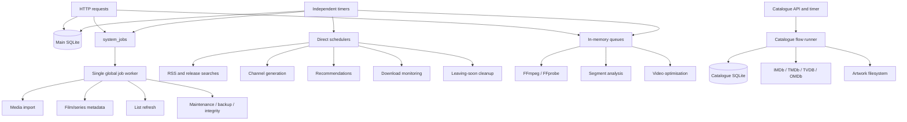

# Server Task and Queue Review

Review date: 2026-08-09

## Implementation progress

The first P0 correctness slice was implemented on 2026-08-09 after this review:

- System-job handlers are registered before the runner can make its initial claim.
- An explicitly empty handler allow-list now claims no jobs.
- System-job deduplication and claims run in SQLite `IMMEDIATE` transactions.
- Completion and failure transitions apply only to jobs that are still `running`.
- Active runner jobs have an `AbortController`, and the system cancellation route signals it.
- Explicit manual retry resets attempts, timestamps, locks, and the previous error.
- Orphaned running system jobs are requeued during single-process application startup.
- Claim-oriented system-job and catalogue indexes were added.
- Daily IMDb imports no longer reopen completed enrichment for every accepted title.
- Catalogue enrichment and artwork claims are atomic and stop after five attempts.
- Interrupted catalogue processing rows are recovered instead of remaining permanently `processing`.
- The segment backfill selects eligible seasons before applying its page limit.
- Durable jobs now execute in independent bounded lanes: imports, metadata,
  lists, maintenance, and a default lane. Lane concurrency is configurable.
- Running durable jobs renew their lock with a 30-second heartbeat and handlers
  have lane-appropriate execution deadlines.
- Durable jobs now carry priority. Manual imports and metadata/list refreshes
  outrank scheduled bulk refreshes within their lane, preventing an old
  background backlog from indefinitely delaying a user action.
- Film metadata provider requests, film/series metadata refresh loops, list
  refresh loops, and media-import boundaries now honor cooperative cancellation.
- Shutdown aborts active durable handlers and allows a bounded grace period for
  them to finish before catalogue storage is closed.
- Activity reporting now includes durable system jobs and catalogue flow,
  ingest, movie, and artwork queues.
- System-job administration supports cursor/status/type filtering and exposes
  lane capacity plus grouped backlog/oldest-age summaries.

The subsequent scale and recovery slice was also implemented on 2026-08-09:

- Film and series collection APIs support deterministic cursor pagination while
  retaining the legacy unpaged array contract. The Admin client now traverses
  bounded 250-item pages rather than requesting an unbounded query.
- Series collection statistics are calculated by one aggregate query instead
  of one query per series.
- Loudness measurement and season segment analysis now create durable
  `system_jobs` records, claim known rows atomically, retry failures, recover
  interrupted rows, and discover backfill work in finite batches.
- User-requested episode loudness rewrites are durable, high-priority system
  jobs and pass cancellation into FFmpeg.
- Video optimisation jobs are persisted in `video_optimisation_jobs`. Queued
  and pre-replacement work is recovered safely; an interruption during atomic
  replacement becomes a terminal operator-review state and is never retried
  blindly.
- TMDB, TVDB, Fanart.tv, and Skyhook calls now share provider-wide concurrency,
  minimum-spacing, `Retry-After`, jittered retry, and circuit-breaker controls.
  Their live limiter state is included in `/system/jobs/summary`.
- Embedded Fanart.tv fallback credentials were removed. Fanart lookups now run
  only when `FANART_API_KEY` is configured.
- Main-database migrations 23 and 24 add catalogue cursor indexes and durable
  video optimisation storage.

The completion pass on 2026-08-09 closed the remaining queue defects and added
API/worker process isolation:

- Catalogue movie and series hydration now claim rows atomically in SQLite
  `IMMEDIATE` transactions and enforce the five-attempt ceiling at claim time.
- Catalogue provider enrichment keeps partially successful items retryable and
  skips providers already marked complete; older prematurely completed rows are
  reopened on runner recovery.
- Malformed durable loudness and segment payloads are failed explicitly instead
  of being selected forever without becoming executable.
- Video optimisation shutdown stops new claims, cancels active encodes, waits a
  bounded grace period, and safely requeues pre-replacement work. Atomic
  replacement itself remains non-interruptible and is allowed to finish.
- Main-provider clients use one retry implementation around the shared gate;
  direct artwork calls no longer bypass transient retry behavior.
- Worker concurrency and provider limits are represented in typed TOML config
  and mirrored to the legacy environment-based consumers.
- Catalogue enrichment and artwork are now pumped continuously in bounded,
  configurable batches while eligible backlog exists; daily IMDb ingestion is
  no longer the sole opportunity to drain those queues.
- Migration 25 aligns film/series cursor indexes with their `COALESCE` ordering
  expressions and adds a lane-order index for durable job claims. Catalogue
  movie and ingest queues also have claim-oriented indexes.
- The built production entrypoint is now a supervisor with separate API and
  worker child processes. A worker crash or hard timeout is restarted without
  taking down HTTP; an API exit drains the whole runtime.
- `runtime_processes` records API/worker heartbeats, and one renewable
  `background-worker` lease prevents two workers from concurrently owning the
  non-partitioned Catalogue, video, automation, and torrent runtimes.
- `system_jobs` claims now carry a process-unique `lease_owner`; heartbeat,
  completion, and failure updates are ownership-conditional. Expired leases are
  recovered periodically rather than requeueing every running row at startup.
- Cooperative deadlines remain the normal cancellation path. A handler still
  running 30 seconds after its deadline is failed/requeued and the worker exits,
  allowing the supervisor to enforce a hard process boundary.
- Catalogue API runners only create/read/cancel durable runs. The worker claims
  and executes queued DAGs and polls durable cancellation state.
- Loudness, segment, video optimisation, track cleaning, library scans, and
  quarantine restores are producer/executor separated. API routes enqueue work;
  only the worker starts FFmpeg/scans or pumps their durable queues.
- The embedded torrent session is worker-owned. API routes use durable torrent
  command rows and a worker-published status snapshot instead of sharing a
  process-local singleton.
- Worker-written durable events are relayed by the API to SSE clients. Health
  and job summaries expose process heartbeat state and report a missing worker.
- Migrations 26 and 27 add process/lease ownership plus the torrent runtime
  bridge. Terminal torrent commands and stale process rows have bounded retention.

The detailed findings below preserve the pre-implementation review baseline;
this progress section is authoritative where they differ. Remaining work is
operational assurance rather than basic process separation: mandatory pagination
requires an approved API-version change; queue families still use several status
tables; one singleton worker is intentional; and load/soak/crash-loop benchmarks
have not yet proven throughput or SQLite contention at target scale.

## Executive conclusion

Archivist's storage layer can hold large catalogues, and the implemented queue
changes remove the principal correctness and head-of-line-blocking defects found
in this review. It now has bounded durable lanes, priority, renewable ownership,
API/worker isolation, worker-owned media and torrent execution, restart recovery,
bounded catalogue reads, and shared main-provider load controls. Tens-of-thousands
readiness is still not proven because no repository load/soak suite establishes
throughput, API latency, worker crash recovery, or SQLite write contention at
that scale.

The original central problem was fragmentation. The following baseline explains
why the changes above were required:

- One durable database queue executes only one job at a time.
- Catalogue flows use a separate, partially durable execution system.
- Media processing has several unrelated in-memory queues.
- Release monitoring, missing searches, recommendations, channels, downloads, and cleanup run from independent timers.
- All of this runs inside the same Node process and competes for one event loop, synchronous SQLite access, network capacity, disk I/O, and CPU.

No files or database state were changed during the review itself.

## Current data snapshot

Read-only snapshot taken at `2026-08-09T05:13:35Z`:

| Area | Current state |
|---|---:|
| Main database size | 52 MB |
| User-library films | 71 |
| User-library series | 5 |
| User-library episodes | 83 |
| Catalogue database size | 6.9 GB |
| Catalogue films | 900,734 |
| Catalogue series | 371,848 |
| Pending catalogue enrichment | 1,272,514 |
| Pending artwork downloads | 6,504 |
| Completed artwork downloads | 300 |
| Failed durable system jobs | 284 |
| Successful durable system jobs | 969 |

Failed system jobs include:

- 175 media imports
- 90 series metadata refreshes
- 19 list refreshes

The catalogue had a `daily-sync` run recorded as running since `2026-08-08T09:15:01Z`, processing `title.principals`. Several earlier daily runs were interrupted, cancelled, or failed at the same large IMDb-import stage.

"Running" here means the database row said running; the review environment could not verify the host process itself.

## How work ran at review time



### Execution systems

| System | Persistence | Concurrency | Restart behaviour | Main risks |
|---|---|---:|---|---|
| `system_jobs` | Durable SQLite rows | 1 globally | Queued jobs survive; running recovery is delayed | Head-of-line blocking, broken running cancellation |
| Catalogue flows | Run/node rows persisted | Sequential within each flow; different flow keys may overlap | Interrupted runs marked failed, not resumed | Duplicate processing, multi-hour restart loss |
| Loudness queue | Memory only | 1–2 | Rebuilt with full-library scan | Loads entire backlog into memory |
| Segment queue | Memory only | Configurable | Best-effort rediscovery | Sweep starvation after first page |
| Track-cleaning/FFmpeg queue | Memory only | Default 2 | Lost | No durable recovery |
| Video optimisation | Memory only | Configurable | Jobs lost; quarantine manifest survives | Incomplete job recovery |
| Release polling | Timer and in-memory sets | Up to 4 indexers | Recalculated on restart | Separate resource/rate budget |
| Targeted release search | Timer and DB state | 2 | Mostly recoverable from DB state | Separate execution system |
| Missing search | Timer and DB schedule claims | Sequential items | Schedule rows durable | Builds full missing-item collection first |
| Channels/recommendations/cleanup | Direct timers | Ad hoc | Re-evaluated on restart | Work is invisible to central job monitoring |

## The durable `system_jobs` queue

The schema is in `packages/db/src/schema.ts`, lifecycle operations in `apps/server/src/system/event-store.ts`, and execution in `apps/server/src/system/job-runner.ts`.

### What is good

- Jobs are persisted.
- Attempts and maximum attempts are recorded.
- Delayed retry is supported.
- Jobs have subject identifiers and JSON payloads.
- Jobs and events have retention maintenance.
- Only registered job types are normally claimed.
- The runner prevents overlapping ticks within one process.

### Serious problems

#### 1. One job blocks every other durable job

`runOnce()` claims one job and awaits the entire handler. Media imports, metadata refreshes, backups, integrity scans, maintenance, and list refreshes all share that one slot.

A slow series metadata refresh can therefore prevent:

- Film metadata refresh
- Imports
- List refreshes
- Backups
- Integrity scans
- Maintenance
- Stale-job recovery

The two-second poll interval creates a theoretical ceiling of about 43,200 trivial jobs per day. Real handlers involve providers, filesystem operations, or complete series refreshes, so actual capacity is much lower.

#### 2. Startup ordering is wrong

The app starts the runner before handlers are registered:

- `startJobRunner()` in `apps/server/src/app.ts`
- Handler registration later in `apps/server/src/routes.ts`

The runner immediately calls `runOnce()`. When no handlers exist, it passes an empty type list. The claim function treats an empty list as "no type restriction", so it can claim any queued job and fail it with "No handler registered".

This should be fixed before further queue scaling work.

#### 3. Running cancellation is not real

`cancelJob()` changes the row to `cancelled`, but does not signal the active handler. When the handler returns, `completeJob()` unconditionally changes it to `succeeded`.

Consequences:

- A user can cancel a job and the operation still executes.
- The reported final status can contradict the user's action.
- Filesystem or media operations continue without cooperative cancellation.

#### 4. Manual retry does not reset attempts

`retryJob()` resets status and timing but leaves `attempts` unchanged.

A job manually retried after reaching its maximum generally receives only one more execution before immediately becoming terminal again.

#### 5. Stale recovery depends on the blocked queue

Stale running jobs are recovered by system maintenance in `apps/server/src/system/maintenance.ts`. Maintenance is itself a `system_jobs` job.

If the global worker is stuck, the recovery job cannot run. The default stale threshold is also measured in hours, not a renewable lease.

There is no immediate startup recovery of stale `system_jobs`.

#### 6. Deduplication is not atomic

`enqueueUniqueJob()` performs a `SELECT` for existing work followed by a separate `INSERT`.

There is no database uniqueness constraint enforcing the idempotency rule. Concurrent producers could enqueue duplicate work.

#### 7. Claiming is not multi-worker safe

Claiming performs a `SELECT`, followed by a separate conditional `UPDATE`. The process-level `running` flag makes this mostly safe for the current single worker, but it is not a sound basis for adding worker processes.

#### 8. Queue indexes do not match queue access

The existing index is effectively:

```sql
(status, created_at)
```

The claim query filters by:

```sql
status, available_at, optionally type
```

and orders by `id`.

As job history grows, claim and uniqueness checks will perform unnecessary scanning.

#### 9. No handler deadline

The runner provides no job-level timeout. Individual clients sometimes have their own timeout, but a handler containing a hung promise can occupy the global worker indefinitely.

## Catalogue execution

The catalogue is not using `system_jobs`. It has its own runner in `apps/server/src/catalogue-runner.ts`.

### Execution behaviour

- Calling `run()` inserts a queued run and starts it with `setImmediate`.
- Nodes are topologically ordered but executed sequentially.
- Only another run with the same `flow_key` is prohibited.
- Different flow types can run concurrently against the same catalogue database.
- Cancellation uses `AbortController`, which is better than system-job cancellation.
- On restart, queued/running/cancelling runs are marked failed.
- Runs restart rather than resume from a durable cursor.

Although `setImmediate` makes the API return asynchronously, execution still happens in the server process. SQLite work is synchronous and can block HTTP and other timers.

### Current capacity is radically below the backlog

The daily flow defaults in `apps/server/src/catalogue-runner.ts` are:

- Enrichment: 250 items per daily run
- Artwork: 100 downloads per daily run

At those rates:

- 10,000 enrichment records take 40 days.
- The current 1,272,514-record backlog takes about 5,090 days.
- The current 6,504 artwork backlog takes about 65 days.

That calculation assumes the daily flow reaches those nodes. Recent runs spend hours processing IMDb datasets and frequently do not reach enrichment or artwork.

### The most damaging catalogue behaviour

Every accepted IMDb record is requeued for enrichment during every snapshot import in `apps/server/src/catalogue-imdb.ts`.

On conflict, completed records are changed back to `pending` unless currently processing. This means a daily import can requeue approximately 1.27 million records while the same daily flow can enrich only 250.

This guarantees that the backlog cannot converge.

Enrichment should be queued only when:

- The item is new.
- Relevant source data changed.
- A provider-specific refresh deadline has arrived.
- A prior provider attempt needs retrying.

### Partial provider failure is lost

The enrichment loop tries OMDb, TVDB, and TMDb sequentially. If one provider succeeds and another fails, the ingest queue row is marked `done`. The provider-specific failure remains recorded, but the ingest queue will not automatically retry that incomplete provider state.

### Claims are not protected against overlapping flows

Rows are selected, then changed to processing without a status condition. An `enrich-items` flow and `daily-sync` flow can select the same pending records before either updates them.

### Retry is effectively unbounded

Catalogue ingest and artwork queues record attempts, but selection does not enforce maximum attempts or move exhausted work into a terminal/dead-letter state. Permanently invalid records can be retried forever.

### Large IMDb import recovery is too coarse

IMDb is processed in batches, but an interrupted dataset does not have a durable row offset or chunk checkpoint. Completed datasets for the same day can be skipped, but the currently interrupted dataset is reread from the beginning.

The current database demonstrates the effect: multiple runs have processed tens of millions of `title.principals` rows before being interrupted.

## In-memory media queues

### Loudness

The queue is deliberately separated from the global queue and bounded to one or two FFmpeg processes, which is sensible for CPU control.

However, `sweepUnmeasured()` selects every unmeasured film and episode and enqueues all of them in memory in `apps/server/src/player/loudness.ts`.

At tens of thousands of library items this causes:

- Large startup queries
- Large in-memory arrays
- Huge monitoring responses
- No durable per-item failure/backoff state
- Repeated retry after every restart for persistent failures

### Segments

The segment queue is also in memory. Its sweep selects the first 50 seasons by ID, then determines eligibility after selection in `apps/server/src/segments/queue.ts`.

Once those first 50 seasons become ineligible, they can still occupy every subsequent sweep page. Later seasons may never be reached. This is a pagination/starvation defect.

### Track cleaning and video optimisation

Both have bounded concurrency and real child-process cancellation. Video replacement also has a quarantine manifest, which is a useful safety mechanism.

But the jobs themselves are held in memory:

- `apps/server/src/services/media-processor.ts`
- `apps/server/src/tools/video-engine/queue.ts`

A restart loses queued and active work state.

## Release and acquisition automation

This part is better bounded than the catalogue:

- RSS polling has a maximum concurrency of four.
- Targeted post-air search has concurrency two.
- Missing search is sequential with a delay between items.
- Scheduled missing-search windows are claimed with a database uniqueness constraint.

However, these workers are outside the durable job runner and do not share a common provider rate limiter or resource budget.

The missing-search cycle also constructs the complete missing-item collection before reducing it to its scheduled batch. With tens of thousands of missing episodes, that becomes avoidable query, allocation, and filtering work.

## SQLite and synchronous execution

The databases use WAL, foreign keys, a five-second busy timeout, a 64 MB page cache, and memory-mapped reads in `packages/db/src/client.ts`. Those are reasonable single-host defaults.

SQLite itself is not the immediate problem. Tens of thousands of records are well within its normal capability.

The problem is that `better-sqlite3` is synchronous:

- Large queries block the Node event loop.
- Large write batches delay HTTP requests and timer callbacks.
- FTS rebuilds and integrity checks execute in the application process.
- Multiple internal task systems can compete for writes without coordinated backpressure.

The catalogue integrity step deletes and completely rebuilds several FTS indexes in one synchronous operation in `apps/server/src/catalogue-runner.ts`. On a multi-gigabyte database, this can materially stall the server.

## Large-list API risks

The admin film endpoint returns every matching film without pagination in `apps/server/src/modules/films/routes.ts`.

The admin series endpoint also returns every series and then executes a complex aggregate query once per series in `apps/server/src/modules/series/routes.ts`.

For 10,000 series that means approximately 10,001 synchronous queries for one request.

The Player API supports cursor pagination, but retains an unpaged compatibility mode when pagination parameters are absent. That leaves an accidental path to very large responses.

## Monitoring gaps

The activity monitor includes:

- Segment processing
- Loudness
- Video/audio processing
- Track cleaning
- Torrents

It does not include:

- `system_jobs`
- Catalogue flows
- Catalogue enrichment/artwork backlog
- Metadata refreshes
- Backups and integrity scans
- Release search work
- Missing-search cycles
- Channel generation
- Recommendations

The relevant implementation is in `apps/server/src/system/activity-monitor.ts` and `apps/server/src/system/processing-monitor.ts`.

The UI can therefore report "idle" while substantial database, provider, or filesystem work is running.

There are no repository-supported metrics for:

- Oldest queue age
- Throughput by task type
- Runtime percentiles
- Lease age
- Retry rate
- Dead-letter count
- Provider rate-limit usage
- Scheduler heartbeat
- Backlog ETA

## Test coverage

Existing tests verify:

- Basic enqueue, retry, and queued cancellation
- A queued job row survives a second database connection
- Catalogue run/node status
- Interrupted catalogue runs become failed
- Basic artwork queue behaviour
- Basic loudness backfill

They do not cover the critical failure modes found here:

- Cancelling an actively running durable job
- Preventing completion from overwriting cancellation
- Startup with queued jobs before handlers are registered
- Concurrent unique enqueue
- Concurrent claimers
- Stale-job startup recovery
- Hung handler deadlines
- Segment sweep pagination beyond the first batch
- Catalogue flow overlap
- Million-row queue performance
- 10,000-item API performance
- Process termination during imports, downloads, or media transformation

There are no meaningful queue load or throughput tests.

## Recommended target architecture

### 1. Keep SQLite for now, but create one task contract

A 10,000-item single-host library does not inherently require Redis or PostgreSQL.

Create one durable task model with:

- `queue_name` or resource lane
- `priority`
- `idempotency_key`
- `library_id`
- `status`
- `lease_owner`
- `lease_expires_at`
- `heartbeat_at`
- `cancel_requested_at`
- `progress_current` and `progress_total`
- `attempts` and `max_attempts`
- `available_at`
- `last_error`
- `created_at`, `started_at`, and `finished_at`

Use the same lifecycle semantics for catalogue enrichment, artwork, imports, metadata, and media analysis even if specialised tables continue to store domain-specific details.

### 2. Separate work into resource lanes

Recommended starting lanes:

| Lane | Suggested concurrency | Work |
|---|---:|---|
| `interactive` | 2–4 | User-requested metadata refresh, manual imports |
| `provider` | 4–8 total, provider-limited | TMDb, TVDB, OMDb |
| `filesystem` | 2 | Artwork, NFO, import copies/moves |
| `cpu-media` | 1–2 | FFmpeg, loudness, segment analysis |
| `maintenance` | 1 | Backup, integrity, FTS maintenance |
| `bulk-catalogue` | 1 | IMDb dataset import |

An integrity scan should never block an interactive import or metadata refresh.

Provider concurrency must be governed by per-provider limits, not only by worker count.

### 3. Move workers out of the HTTP process

**Implemented.** The supervisor now runs the API and task worker as separate
processes in one container. The following was the rationale for that change:

This provides:

- HTTP responsiveness during catalogue imports
- Independent worker restart
- Real task timeouts
- Configurable resource allocation
- A route toward multiple worker processes later

If concurrent SQLite writers become the limiting factor, either retain a single database-writing worker with concurrent network fetches, or migrate high-concurrency task state to PostgreSQL. Redis should be optional coordination/wakeup infrastructure, not the only durable source of job state.

## Prioritized fixes

### P0 — correctness and backlog survival

1. Register all handlers before starting `JobRunner`.
2. Treat an empty registered-type list as "claim nothing".
3. Make completion conditional on `status = 'running'`.
4. Add cooperative cancellation with `AbortSignal`.
5. Reset attempts and error fields on explicit manual retry.
6. Recover expired leases at startup, outside the job queue.
7. Add handler deadlines and renewable leases.
8. Make unique enqueue atomic with a database constraint.
9. Make catalogue claims atomic and status-conditional.
10. Stop requeueing every IMDb item on every snapshot import.
11. Add maximum attempts and dead-letter states to catalogue queues.
12. Fix segment sweep eligibility and pagination.

### P1 — scale

1. Separate worker lanes and concurrency limits.
2. Run bulk catalogue work outside the HTTP process.
3. Add cursor pagination to admin film and series endpoints.
4. Replace the series N+1 aggregation with one grouped query or maintained summary table.
5. Make loudness and segment backfills paged and durably checkpointed.
6. Retry failed metadata providers independently.
7. Add indexes matching claims, including:
   - `system_jobs(status, type, available_at, priority, id)`
   - Catalogue ingest source/entity/status/availability
   - Artwork status/availability
   - Series metadata refresh deadlines
8. Throttle progress persistence rather than updating run rows for every enriched item.
9. Make FTS updates incremental; reserve full rebuilds for explicit maintenance.

### P2 — operations and assurance

1. Build one processing dashboard covering every execution system.
2. Expose backlog count, oldest age, rate, failures, and ETA by lane/type.
3. Add scheduler heartbeat and stuck-worker alerts.
4. Add load fixtures for:
   - 10,000 films
   - 10,000 series with hundreds of thousands of episodes
   - One million catalogue items
   - 100,000 queued jobs
5. Test crash recovery during every destructive or long-running stage.
6. Add per-provider circuit breakers and rate-limit visibility.
7. Record structured correlation IDs from user action through job, provider requests, and persistence.

## Overall assessment

| Area | Assessment |
|---|---|
| Data-model capacity | Good enough for tens of thousands; catalogue already exceeds one million |
| Durable job persistence | Implemented for system/media work and Catalogue runs; specialised queue tables remain |
| Concurrency management | Bounded lanes and provider gates; one active worker by design |
| Cancellation | Durable and cooperatively polled; hard timeout restarts the worker |
| Retry handling | Lease-aware for system jobs; domain retry policies still differ |
| Crash recovery | Worker leases and expired claims recover; destructive stages remain conservative |
| Backpressure | Bounded claims/lanes exist; target-scale throughput is unbenchmarked |
| Large-library API behaviour | Cursor paths exist; legacy unpaged compatibility remains |
| Catalogue throughput | Continuously pumped but not load/soak validated |
| Monitoring | Process health and queue summaries exist; ETA/alerting remain incomplete |
| Media replacement safety | Better than the rest of the task architecture |
| Test coverage for queue correctness | Core lease/isolation paths covered; crash-loop/load coverage insufficient |

The P0 correctness and process-isolation work is complete. The remaining release
gate for a tens-of-thousands claim is evidence: supervised crash tests, sustained
queue throughput, API latency under worker load, and SQLite contention benchmarks.
